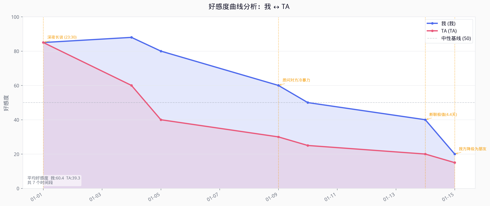

<div align="center">

# Heartbeat

> *"The rhythm of feelings, hidden in every 'typing...'."*
> *Turn thousands of chat logs back into the trajectory of your resonating heartbeats.*

[](LICENSE)
[](https://python.org)
[](https://claude.ai/code)

[Demo](#demo) · [Features](#features) · [Installation Guide](INSTALL_EN.md) · [Quick Start](#quick-start) · [**中文**](README.md)

</div>

---

## Demo

### Dual Favorability Line Chart


### Comprehensive Diagnostic Report Sample
> **Overall Assessment**: The other party's favorability is declining, while ours remains invested. This misalignment is a common precursor to relationship deterioration.
> **Key Time Points to Watch**: 2024-01-15: Me -5.0 / Them -22.0

For a complete report example, see [examples/sample_report.md](examples/sample_report.md)

---

**Heartbeat** is a bidirectional favorability curve analyzer. By feeding it chat logs (WeChat, iMessage, SMS), it analyzes the emotional dynamics between you and the other person, generating a dual-line chart and a detailed diagnostic report.

## Features

- 📊 **Bidirectional Quantification** — Simultaneously analyzes favorability changes for both "Me" and "Them" instead of just looking at the other party.
- 📈 **Line Chart** — Generates a dual favorability line chart segmented by week/month/day (PNG, 300 DPI).
- 📝 **Text Report** — Relationship overview, key nodes, behavioral profiles for both sides, and overall diagnosis.
- 🔄 **Two Modes** — Review (for ended relationships) and Track (continuous updates).
- 💬 **Multi-format Support** — WeChat TXT/HTML/CSV, iMessage, SMS XML, plain text paste.

## Quick Start

### Install Dependencies

```bash
pip install -r requirements.txt
```
> For complete Claude Code mounting steps and global setup, please refer to the **[Installation Guide](INSTALL_EN.md)**.

### Usage in Claude Code

```
/heartbeat-review    ← Review an ended relationship
/heartbeat-track     ← Track an ongoing relationship
/heartbeat-update    ← Append new chat logs to update the curve
/heartbeat-list      ← List all saved analysis sessions
```

## Toolchain

```
Chat Log Files
    ↓
tools/chat_parser.py      → parsed.json    (Bidirectional message list + feature extraction)
    ↓
tools/sentiment_scorer.py → scores.json    (Bidirectional favorability scores per time window)
    ↓
tools/heartbeat_plotter.py    → heartbeat.png      (Dual-line chart)
tools/report_writer.py    → report.md      (Text diagnostic report)
```

## Dual-Layer Scoring Model

Every data point generated by Heartbeat is a weighted fusion of two parallel systems:

### 1. Claude Semantic Inference (Core Weight: 80%)
Deep participation by the Claude model to understand genuine contextual nuances:
- Identifies subtext and true emotions (e.g., distinguishing between a playful "whatever" and a dismissive one).
- Automatically captures core emotional events and breaking points in long conversations.
- Automatically lowers confidence on days with too few messages, falling back to rule-based scoring.

### 2. Objective Behavioral Rules (Objective Weight: 20%)
Highly objective, quantifiable analysis based on raw chat metadata:

| Dimension | Sub-Weight | Description |
|-----------|------------|-------------|
| Initiative | 25% | Who initiated messages / percentage of starting conversations |
| Reply Speed | 20% | Average response latency (faster = higher score) |
| Message Length | 15% | Average message richness (longer typically equals more invested) |
| Sentiment Density | 25% | Hit rate of predefined positive/negative sentiment terms |
| Special Behaviors | 15% | Re-asking questions, emojis intensity, affectionate nicknames |

## Session File Structure

```
sessions/{slug}/
├── heartbeat.png       ← Favorability dual-line chart
├── report.md       ← Full analysis report
├── scores.json     ← Time window scoring data
├── parsed.json     ← Parsed message data
├── meta.json       ← Session metadata
└── history/        ← Historical backups
    ├── heartbeat_v1.png
    └── report_v1.md
```

## Standalone Tool Usage

```bash
# Parse bidirectional chat logs
python3 tools/chat_parser.py --file chat.txt --me "You" --them "Them" --output parsed.json

# Calculate favorability scores
python3 tools/sentiment_scorer.py --input parsed.json --window week --output scores.json

# Generate line chart
python3 tools/heartbeat_plotter.py --scores scores.json --me "You" --them "Them" --output heartbeat.png

# Generate text report
python3 tools/report_writer.py --scores scores.json --parsed parsed.json \
  --me "You" --them "Them" --mode review --output report.md
```

---

<div align="center">

*Built for use with Claude Code*

</div>
